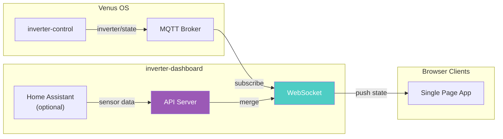
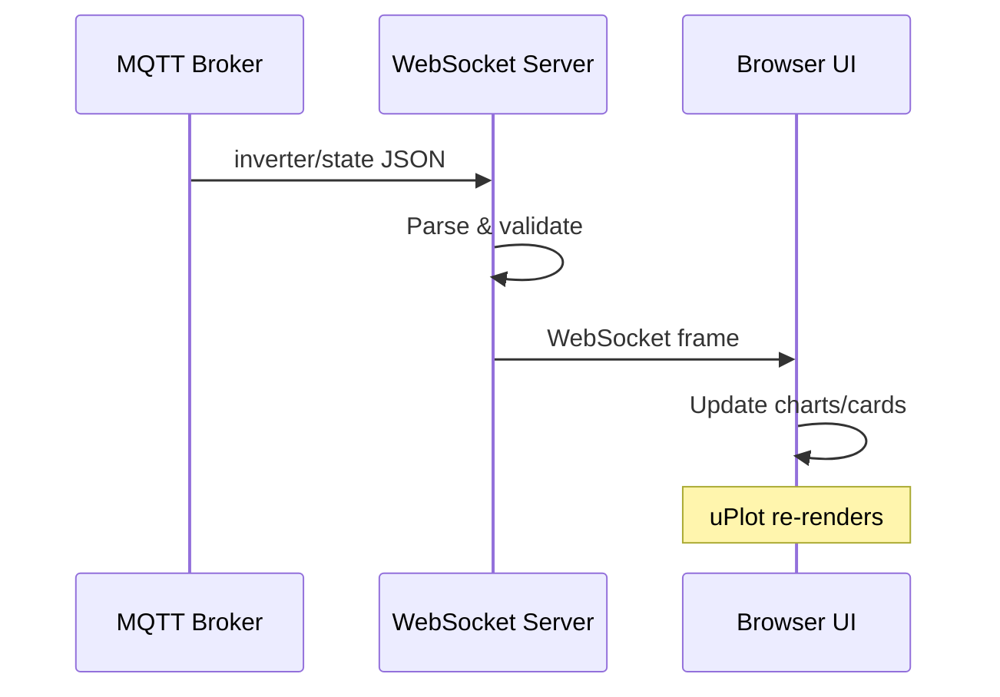
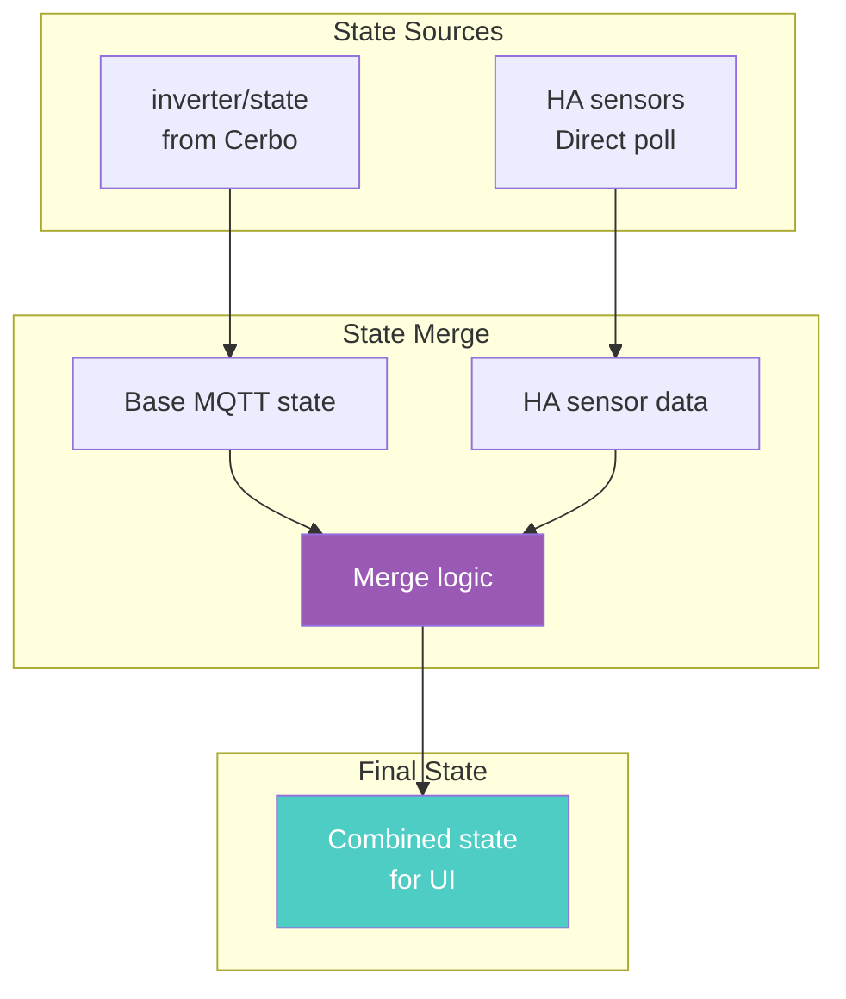

# System Architecture

## Data Flow



## WebSocket Update Flow



## State Merging



## Runbook: Troubleshooting

### Dashboard Shows "Connecting..."

**Symptoms:**
- WebSocket never establishes
- Dashboard stuck on loading screen

**Actions:**
```bash
# Check MQTT connectivity
docker exec inverter-dashboard nc -zv MQTT_HOST 1883

# Verify broker has data
docker exec inverter-dashboard mosquitto_sub -v -t 'inverter/state' -C 1

# Check logs
docker logs inverter-dashboard --tail 50
```

### Stale Data

**Symptoms:**
- Dashboard shows old values
- Charts not updating

**Actions:**
```bash
# Verify inverter-control is publishing
mosquitto_sub -v -t 'inverter/state' -C 5

# Check WebSocket connection
# Open browser devtools → Network → ws://... → messages

# Restart dashboard
docker restart inverter-dashboard
```

### Home Assistant Sensors Missing

**Symptoms:**
- Appliance status not showing
- Water level N/A

**Actions:**
```bash
# Verify HA is reachable
curl -s -H "Authorization: Bearer $HA_TOKEN" \
  $HA_URL/api/states/sensor.home_totalusage_1s | jq

# Check local_config.py has correct entity IDs
docker exec inverter-dashboard cat /app/config/local_config.py
```

---

## Related Documentation

- [inverter-control System Architecture](../inverter-control/.github/docs/system-architecture.md)
- [ADR-001: MQTT Bridge Architecture](../inverter-control/.github/docs/adr-001-grid-zero-architecture.md)
