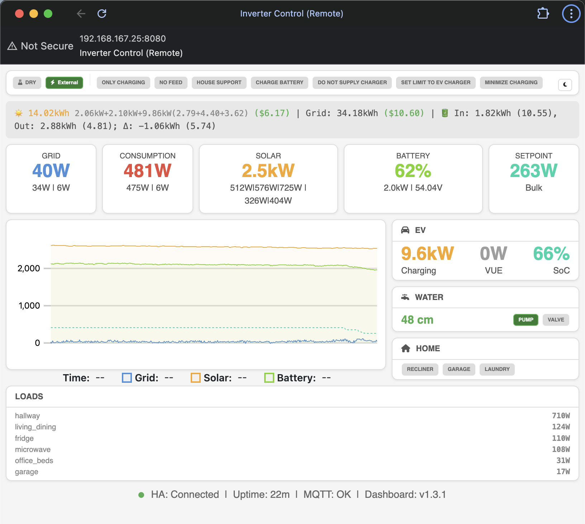

# Inverter Dashboard

[](https://hub.docker.com/r/alvit/inverter-dashboard)
[](LICENSE)

Real-time web dashboard for monitoring Victron inverter systems via MQTT. Designed to work with [inverter-control](https://github.com/victron-venus/inverter-control) on Cerbo GX.



## Features

- Real-time power monitoring (Grid, Solar, Battery, Consumption)
- Interactive controls via WebSocket
- Live power charts with uPlot
- EV charging status
- Water system monitoring
- Home automation controls
- Mobile-friendly responsive UI

## Quick Start

### Docker (Recommended)

```bash
docker run -d \
  --name inverter-dashboard \
  -p 8080:8080 \
  -e MQTT_HOST=192.168.1.100 \
  alvit/inverter-dashboard:latest
```

### Docker Compose

```yaml
version: '3.8'
services:
  dashboard:
    image: alvit/inverter-dashboard:latest
    ports:
      - "8080:8080"
    environment:
      - MQTT_HOST=192.168.1.100
      - MQTT_PORT=1883
    restart: unless-stopped
```

### Portainer Stack

See [portainer-stack.yml](portainer-stack.yml) for Portainer deployment.

## Configuration

| Environment Variable | Default | Description |
|---------------------|---------|-------------|
| `MQTT_HOST` | `192.168.160.150` | MQTT broker hostname |
| `MQTT_PORT` | `1883` | MQTT broker port |
| `WEB_PORT` | `8080` | Web server port |

### Command Line Arguments

```bash
python server.py --mqtt-host 192.168.1.100 --mqtt-port 1883 --port 8080
```

### HTTPS (why you still see `http://`)

By default the app and the published Docker image listen on **plain HTTP** (port `8080`). Nothing is wrong with your deploy — TLS is not enabled unless you add it.

**Choose one approach:**

1. **Reverse proxy (recommended for production / LAN DNS)**  
   Put **Caddy**, **Traefik**, or **nginx** in front of the container on port **443**, terminate Let’s Encrypt (or your certs) there, and proxy to `http://inverter-dashboard:8080`. You open `https://dashboard.example.com` in the browser; the container keeps HTTP internally.

2. **TLS inside the Python app** (good for quick tests / single host)

   Generate certs (repo includes a helper):

   ```bash
   ./scripts/ssl-local-deploy.sh
   # Optional: TLS_CN=myhost.local ./scripts/ssl-local-deploy.sh
   ```

   Trust the cert on your Mac (script prints the exact `security add-trusted-cert` command).

   Run locally:

   ```bash
   python server.py --mqtt-host … --port 8443 \
     --ssl-cert .certs/dashboard.crt --ssl-key .certs/dashboard.key
   ```

   **Docker Compose:** mount the cert directory and override the command so uvicorn uses TLS (match published port to `--port`):

   ```yaml
   services:
     inverter-dashboard:
       image: alvit/inverter-dashboard:latest
       ports:
         - "8443:8443"
       environment:
         - MQTT_HOST=192.168.x.x
         - WEB_PORT=8443
       volumes:
         - ./certs:/app/certs:ro
       command:
         [
           "--mqtt-host", "192.168.x.x",
           "--port", "8443",
           "--ssl-cert", "/app/certs/dashboard.crt",
           "--ssl-key", "/app/certs/dashboard.key",
         ]
   ```

   Put `dashboard.crt` / `dashboard.key` in `./certs/` on the host (e.g. copy from `.certs/` after running the script).

   **Note:** The Dockerfile `HEALTHCHECK` probes **`http://127.0.0.1:$WEB_PORT/api/state`** on plain HTTP. If you run **HTTPS only** inside the container on the same port, override or disable the healthcheck in Compose, e.g. `healthcheck: disable: true` or a `curl -fk https://localhost:8443/api/state` probe.

3. **`mkcert`** — alternative to OpenSSL for local dev trust; still point the app at the generated `.pem` paths with `--ssl-cert` / `--ssl-key`.

## MQTT Topics

### Subscribed (incoming data)
- `inverter/state` - JSON with current system state
- `inverter/console` - Console log messages

### Published (commands)
- `inverter/cmd/toggle` - Toggle boolean entities
- `inverter/cmd/press` - Press button entities
- `inverter/cmd/setpoint` - Set power setpoint
- `inverter/cmd/dry_run` - Toggle dry run mode
- `inverter/cmd/limits` - Set power limits
- `inverter/cmd/ess_mode` - Toggle ESS mode
- `inverter/cmd/loop_interval` - Set control loop interval

## Expected State Format

```json
{
  "gt": 150,
  "g1": 100,
  "g2": 50,
  "tt": 2500,
  "t1": 1500,
  "t2": 1000,
  "solar_total": 3500,
  "battery_soc": 85,
  "battery_power": -500,
  "battery_voltage": 52.4,
  "setpoint": 0,
  "inverter_state": "Inverting",
  "dry_run": false,
  "ess_mode": {
    "mode_name": "Optimized (with BatteryLife)",
    "is_external": false
  },
  "booleans": {
    "auto_mode": true,
    "ev_boost": false
  },
  "daily_stats": {
    "produced_today": 25.5,
    "produced_dollars": 7.65,
    "grid_kwh": 2.3
  }
}
```

## Development

### Local Setup

```bash
# Clone repository
git clone https://github.com/victron-venus/inverter-dashboard.git
cd inverter-dashboard

# Create virtual environment
python -m venv venv
source venv/bin/activate

# Install dependencies
pip install -r requirements.txt

# Run
python server.py --mqtt-host your-mqtt-broker
```

### Build Docker Image Locally

```bash
docker build -t inverter-dashboard .
docker run -p 8080:8080 -e MQTT_HOST=192.168.1.100 inverter-dashboard
```

## Multi-Architecture Support

Docker images are built for:
- `linux/amd64` (x86_64)
- `linux/arm64` (Raspberry Pi 4, Apple Silicon, etc.)

## Related Projects

This project is part of a Victron Venus OS integration suite:

| Project | Description |
|---------|-------------|
| [inverter-control](https://github.com/victron-venus/inverter-control) | ESS external control with web dashboard |
| **inverter-dashboard** (this) | Remote web dashboard via MQTT (Docker) |
| [dbus-mqtt-battery](https://github.com/victron-venus/dbus-mqtt-battery) | MQTT to D-Bus bridge for BMS integration |
| [dbus-tasmota-pv](https://github.com/victron-venus/dbus-tasmota-pv) | Tasmota smart plug as PV inverter on D-Bus |
| [esphome-jbd-bms-mqtt](https://github.com/victron-venus/esphome-jbd-bms-mqtt) | ESP32 Bluetooth monitor for JBD BMS |
| [inverter-monitoring](https://github.com/victron-venus/inverter-monitoring) | Telegraf + InfluxDB + Grafana monitoring stack |

## Author

Created by [@4alvit](https://github.com/4alvit)

## License

MIT License - see [LICENSE](LICENSE)
