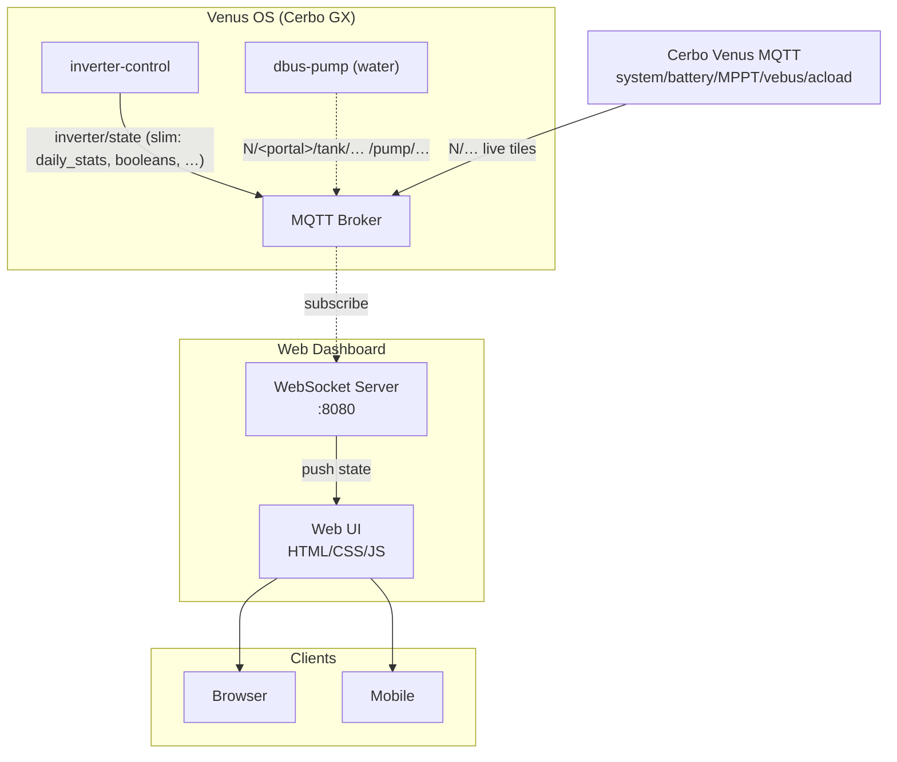

# Inverter Dashboard

[](https://hub.docker.com/r/alvit/inverter-dashboard)
[](https://hub.docker.com/r/alvit/inverter-dashboard)
[](https://github.com/victron-venus/inverter-dashboard/actions/workflows/ci.yml)
[](https://github.com/victron-venus/inverter-dashboard/actions/workflows/codeql.yml)
[](https://github.com/victron-venus/inverter-dashboard/actions/workflows/trivy-fs.yml)
[](https://opensource.org/licenses/MIT)
[](https://github.com/victron-venus/inverter-dashboard/commits/main)
[](https://github.com/victron-venus/inverter-dashboard/graphs/commit-activity)
[](https://www.python.org/downloads/)

Real-time web dashboard for monitoring Victron inverter systems directly through Cerbo GX MQTT or inverter-gateway. [inverter-control](https://github.com/victron-venus/inverter-control) supplies control policy, history and forecasts when available; it is not required to relay live telemetry.

> **Dashboard options:** For Cerbo GX deployments, [**inverter-dashboard-go**](https://github.com/victron-venus/inverter-dashboard-go) is the recommended primary (single binary, low footprint). **This repo** targets Docker/NAS installs (`alvit/inverter-dashboard`). For a native app, see [**inverter-desktop**](https://github.com/victron-venus/inverter-desktop).

---

## Project Role

**This dashboard targets Docker, NAS and general-purpose servers.** The projects share the Vue interface and direct Cerbo telemetry contract:

| Use Case | Recommended |
|----------|-------------|
| Cerbo GX / embedded | [inverter-dashboard-go](https://github.com/victron-venus/inverter-dashboard-go) — single binary, minimal footprint |
| Docker / NAS | [inverter-dashboard](https://github.com/victron-venus/inverter-dashboard) — this repo (`alvit/inverter-dashboard` on Docker Hub) |
| Native desktop/mobile | [inverter-desktop](https://github.com/victron-venus/inverter-desktop) — Rust/Tauri app with offline support |
| Building custom dashboards | [inverter-dashboard-vue](https://github.com/victron-venus/inverter-dashboard-vue) — shared Vue 3 component library |


## Architecture



Live grid / consumption / battery / solar / loads / setpoint come from **Cerbo
Venus MQTT** (same path as [inverter-desktop](https://github.com/victron-venus/inverter-desktop))
**and/or** remote **[inverter-gateway](https://github.com/victron-venus/inverter-gateway)**
(`GATEWAY_ENABLED` + `GATEWAY_URL` → poll `/v1/snapshot`).

**Data-source precedence** (exclusive live path, desktop-aligned):

1. Only `MQTT_HOST` → Cerbo MQTT client.
2. Only IGW (`GATEWAY_ENABLED` + `GATEWAY_URL`) → snapshot poller.
3. Both configured → TCP-probe MQTT; if the broker responds, use MQTT;
   otherwise use IGW. Dual-path may fail over MQTT→IGW and later recover
   when MQTT is reachable again.
4. Neither → no live telemetry source.

Production on `worker-1` clears `MQTT_HOST` so IGW stays primary (one Cerbo MQTT
client on Synology). Local/dev and optional ConfigMaps may set both.
`inverter/state` still carries daemon-only extras (`daily_stats`,
`solar_forecast`, flags, …) when MQTT is used; IGW mode maps Cerbo live tiles
only (daemon extras need HA overlay or a separate source).

### Direct Cerbo telemetry

Point `MQTT_HOST` at the Cerbo broker and set `CERBO_PORTAL_ID` to the GX's VRM
portal ID (shown in its VRM settings). Local MQTT access must be enabled on the GX.
The dashboard subscribes to that portal's native topics before publishing an empty
`R/<portal>/keepalive` to request a full refresh. Further keepalives run every
45 seconds with `suppress-republish`, so an unchanged system does not repeatedly
send its entire tree. Reconnects invalidate old live observations and request a
fresh tree.

When the portal is omitted, the dashboard can learn it from native `system/.../Serial`,
heartbeat or keepalive notifications, or legacy `inverter/portal`. Modern Venus
MQTT notifications are not retained, so a silent broker cannot be discovered
reliably until another client starts notifications. **Configure `CERBO_PORTAL_ID`
for unattended startup**, and whenever the broker's ACL requires portal-scoped
subscriptions. A selected portal stays fixed; another portal's notifications
cannot mix into this dashboard.

The same reducer handles MQTT notifications and complete IGW snapshots:

- Grid and consumption support L1, L2 and L3; systemcalc is preferred, with grid
  meter and connected VE.Bus input fallbacks when native source identity is mains
  or shore power. Generator input is not grid. VE.Bus output alone is not total
  consumption; systemcalc consumption is required to account for the site topology.
- Battery headline readings prefer systemcalc's selected battery measurements.
  The explicitly selected battery instance, or a single unambiguous battery service,
  provides a fallback. Measured SoC is used;
  it is never guessed from a fixed pack voltage range. Per-device tiles include
  identity, temperature, time remaining and cell-voltage diagnostics when available.
- Solar combines DC MPPT and AC PV, without counting device and system totals twice.
  Published totals, including zero, take priority over summed phase powers.
- AC loads use native device names, with instance suffixes for duplicate names.
- Null values, service removal and snapshot omissions invalidate affected readings.
  Invalid JSON and nonnumeric measurements are ignored. `telemetry_available`
  distinguishes missing readings from measured zero; stale controller mirrors
  cannot restore a native reading that became unavailable.

### Water and EV

Water data comes from [dbus-pump](https://github.com/victron-venus/dbus-pump) through
native `tank` and `pump` topics. `Level` is a percentage, including values below
1%; pump `State`/`Status` and `Mode` are read directly. Configure
`WATER_TANK_INSTANCE`, `WATER_PUMP_INSTANCE` and `WATER_VALVE_INSTANCE` to match
that bridge (defaults 21/1/2).

With direct Cerbo MQTT connected, the dashboard can set the configured pump or
valve to Auto (0), forced on (1), or forced off (2) through its native writable
`W/<portal>/pump/<instance>/Mode` path. Controls are enabled only after that
device's Mode is available; the displayed state changes when Cerbo confirms it.
Gateway-only and public views remain read-only for water controls. Home Assistant
switches and controller commands are not used for these overrides; automation
continues to run in dbus-pump.

Vehicle SoC and power come from `ev/<EV_INSTANCE>` (default 22), and wallbox power
from `evcharger/<EVCHARGER_INSTANCE>` (default 40). Vehicle power is watts;
`ev_charging_kw` is kilowatts. These fields do not require a Home Assistant relay
or a full `inverter/state` payload.

## Home Assistant integration

`inverter/state` remains the source of controller-specific fields such as
`daily_stats`, `solar_forecast`, `ess_mode`, `booleans`, `dry_run`, limits and uptime.
The slim controller no longer forwards every appliance or HA entity. Configure
`HA_APPLIANCE_ENTITIES` in `local_config.py` to read the desired appliances directly
from HA. `HA_DIRECT_CONTROLS=True` additionally enables explicitly configured HA
switches and buttons. Use only entities owned by HA; controller policy flags and
native Cerbo power, battery, EV and water readings keep their own sources.

HA is optional for native energy monitoring. IGW snapshots contain live device
telemetry; controller-only history and forecasts are unavailable through IGW unless
a separate source supplies them.

## Deploy to k3s (node `worker-1`)

Python / multi-arch image for NAS and k3s (prefer this over `inverter-dashboard-go` for cluster workers).

Portable examples and the local configuration workflow are in
[`deploy/k3s/`](deploy/k3s/). Copy the manifests into `.local-private/` and set your
worker, gateway URL, portal identifier and ingress host there before deployment.
The example worker is `worker-1`; the namespace is `inverter-dashboard`.

Create real Secrets out-of-band and apply your configured local copy as described
in the runbook. The placeholder Secret is excluded from Kustomize resources.

- Image: `alvit/inverter-dashboard` on Docker Hub. Registry publication promotes approved stable OCI assets; see the [operator runbook](docs/release-workflow.md).
- For IGW-only deployments, use your gateway endpoint and `MQTT_HOST=""`.
  Local/dev can use `MQTT_HOST`, or configure both paths for MQTT-first fallback.
  Set `CERBO_PORTAL_ID` locally for native MQTT bootstrap and configure water/EV instances separately.
- The public Ingress host is a documentation placeholder; configure your own DNS and TLS locally.

## Configuration Reference

In `local_config.py` (created via [`scripts/init-config.sh`](scripts/init-config.sh)):

```python
# Default: MQTT-only mode (recommended)
HA_DIRECT_CONTROLS = False

# Direct polling mode (diagnostic only — not recommended)
HA_DIRECT_CONTROLS = True
HA_URL = "https://homeassistant.local:8123"
HA_TOKEN = "REPLACE_WITH_LONG_LIVED_ACCESS_TOKEN"

# HA entity mappings (used by both modes)
HA_BOOLEAN_ENTITIES = {
    "only_charging": "input_boolean.only_charging",
}
HA_SWITCH_ENTITIES = {
    "home_no_feed": "input_boolean.no_feed",
    "home_house_support": "input_boolean.house_support",
}
```

---

<!-- ci-release-process:start -->
## Release process

See the [release strategy](RELEASING.md) for validation, nightly, beta, RC and stable promotion rules, and the [operator runbook](docs/release-workflow.md) for local commands.
<!-- ci-release-process:end -->

### Run a standalone dashboard

Download a ZIP and its matching `.sha256` file from the
[latest stable release](https://github.com/victron-venus/inverter-dashboard/releases/latest):

- Linux x86_64: `inverter-dashboard-linux-x86_64.zip` (built on Ubuntu 24.04).
- macOS Intel: `inverter-dashboard-macos-x86_64.zip`.
- macOS Apple Silicon: `inverter-dashboard-macos-arm64.zip`.
- Windows x86_64: `inverter-dashboard-windows-x86_64.zip`.

The executable includes Python, its runtime dependencies, and the Vue web
interface. You do not need a source checkout, Python installation, or frontend
build. Extract the archive into a directory where you keep dashboard settings.

On Linux or macOS, make the extracted file executable and start it with your
Cerbo's reachable address in place of `CERBO_IP`:

```sh
chmod +x inverter-dashboard
./inverter-dashboard --mqtt-host CERBO_IP --port 8080
```

On Windows, open PowerShell in the extracted directory:

```powershell
.\inverter-dashboard.exe --mqtt-host CERBO_IP --port 8080
```

Open `http://127.0.0.1:8080` in your browser. The web server binds to loopback by
default. Existing MQTT, gateway, and authentication settings also apply to the
standalone executable; set `DASHBOARD_SECRET` before enabling remote access with
`HOST`. Use `--help` to see the available command-line options.

To verify a download, keep the ZIP beside its checksum file and use
`sha256sum --check <archive>.sha256` on Linux or
`shasum -a 256 --check <archive>.sha256` on macOS. On Windows, compare
`Get-FileHash <archive>.zip -Algorithm SHA256` with the matching checksum file.

---

## Completed Features

- ✅ **Release packaging**: Candidate artifacts and checksums; see the [release strategy](RELEASING.md).
- ✅ **Async MQTT Migration**: Refactored `mqtt_handler.py` to use `aiomqtt` (asyncio wrapper for paho-mqtt) for non-blocking I/O in the FastAPI event loop
- ✅ **Ultra-Slim Multi-Arch Docker Image**: Refactored `Dockerfile` using `uv` (fast Python package installer) and multi-stage builds to reduce image size to ~40MB (achieved 84MB from 149MB - further reduction needs distroless/scratch base)
- ✅ **Static Vue Asset Mounting**: Added FastAPI StaticFiles mounting route for `inverter-dashboard-vue` compiled dist assets

---

## Features

- Real-time power monitoring (Grid, Solar, Battery, Consumption)
- Interactive controls via WebSocket
- Live power charts with ECharts
- EV charging status
- Water system monitoring (dbus-pump via Cerbo MQTT)
- Home automation controls
- Mobile-friendly responsive UI

## Quick Start

### Docker (Recommended)

```bash
docker run -d \
  --name inverter-dashboard \
  -p 8080:8080 \
  -e MQTT_HOST=192.168.1.100 \
  alvit/inverter-dashboard:latest
```

### Docker Compose

```yaml
version: '3.8'
services:
  dashboard:
    image: alvit/inverter-dashboard:latest
    ports:
      - "8080:8080"
    environment:
      - MQTT_HOST=192.168.1.100
      - MQTT_PORT=1883
    restart: unless-stopped
```

### Portainer Stack

See [portainer-stack.yml](portainer-stack.yml) for Portainer deployment.

## Configuration

| Environment Variable | Default | Description |
|---------------------|---------|-------------|
| `MQTT_HOST` | `Cerbo` | Cerbo/LAN MQTT broker. Empty/`""` disables MQTT (IGW-only). May coexist with IGW. |
| `MQTT_PORT` | `1883` | MQTT broker port |
| `GATEWAY_ENABLED` | `false` | Enable remote inverter-gateway snapshot polling (coexists with MQTT; see precedence above) |
| `GATEWAY_URL` | _(empty)_ | IGW base URL, e.g. `https://gateway.example.com` |
| `GATEWAY_ACCESS_CLIENT_ID` | _(empty)_ | Cloudflare Access service-token client id |
| `GATEWAY_ACCESS_CLIENT_SECRET` | _(empty)_ | Cloudflare Access service-token client secret |
| `GATEWAY_API_TOKEN` | _(empty)_ | Bearer token (`Authorization: Bearer …`) matching gateway `GATEWAY_API_TOKEN` |
| `GATEWAY_POLL_INTERVAL` | `2` | Seconds between `/v1/snapshot` polls |
| `WEB_PORT` | `8080` | Web server port (inside the container) |
| `INVERTER_DASHBOARD_CONFIG` | `/app/config` | Host folder mounted read-only: `local_config.py` and optional TLS files |
| `CERBO_PORTAL_ID` | *(empty)* | VRM portal ID for scoped native subscriptions and immediate bootstrap. Required on a silent broker; otherwise passive discovery is available. |
| `WATER_TANK_INSTANCE` / `WATER_PUMP_INSTANCE` / `WATER_VALVE_INSTANCE` | `21` / `1` / `2` | D-Bus device instances on the GX (must match dbus-pump) |

### Secrets (`local_config.py`) + optional HTTPS

Committed template only: [`local_config.example.py`](local_config.example.py). Your real file is **`local_config.py`** in the **repository root** (next to `server.py`) — **gitignored** (never push). There is no separate `config/` folder in the repo.

If Cerbo **inverter-control** uses **`MQTT_SLIM_STATE`** (slim `inverter/state`), dishwasher/washer/dryer fields are omitted from MQTT — add **`HA_APPLIANCE_ENTITIES`** in **`local_config.py`** so the dashboard polls those sensors from Home Assistant (same keys as full MQTT state).

**Synology NAS (deploy path used in this repo):**

| Location | Purpose |
|---------|---------|
| `/volume1/docker/inverter-dashboard/config` | **On the NAS host only:** a folder that is **bind-mounted** read-only into the container as **`/app/config`**. Put **`local_config.py`** here together with optional **`dashboard.crt`** / **`dashboard.key`**. The folder name on disk is convention (matches [`docker-compose.yml`](docker-compose.yml) / [`portainer-stack.yml`](portainer-stack.yml)); it is **not** a `config/` directory inside the Git clone. |

- **After clone (any machine):** `./scripts/init-config.sh` creates **`./local_config.py`** from the example; fill in **`HA_TOKEN`** / **`HA_URL`** (typically the same long-lived token as inverter-control **`secrets.py`**).
- **`postinstall.sh`** (in repo root): run **on your Mac/PC** (not on the NAS). Put **`Host synology`** (user, hostname, keys) in **`~/.ssh/config`**, then simply **`./postinstall.sh`** — it runs **`ssh synology`** by default (override with **`SYNOLOGY_SSH`** only if you use another alias).

  Expects **passwordless `sudo`** on the NAS for **`docker` / `docker compose`** and for writing under **`/volume1/docker/...`**. Files are pushed with **`ssh` + stdin** (not `scp`), so it still works if Synology has disabled the SFTP/SCP subsystem. Then **`sudo install`** from a temp dir. Env: **`SYNOLOGY_SSH`**, **`REMOTE_BASE`**, **`SOURCE_CONFIG`** (defaults to **repo root** next to **`postinstall.sh`**), **`STACK_FILE`**, **`DOCKER`** (default **`sudo /usr/local/bin/docker`** — under **`sudo`** DSM often has no **`docker`** in **`PATH`**). On **macOS**, if **`dashboard.crt`** exists next to **`postinstall.sh`** or under **`.certs/`**, the script imports it as trusted when missing: tries **System** keychain (`System.keychain-db` / `System.keychain`), then **login** keychain if needed (**`SKIP_MAC_TRUST=1`** to skip).

If **both** cert files exist in that folder, the **entrypoint enables HTTPS on the same port** as HTTP would use; otherwise HTTP only.

### Command Line Arguments

```bash
python server.py --mqtt-host 192.168.1.100 --mqtt-port 1883 --port 8080
```

### HTTPS (why you still see `http://`)

By default the app and the published Docker image listen on **plain HTTP** (port `8080`). Nothing is wrong with your deploy — TLS is not enabled unless you add it.

**Choose one approach:**

1. **Reverse proxy (recommended for production / LAN DNS)**
   Put **Caddy**, **Traefik**, or **nginx** in front of the container on port **443**, terminate Let’s Encrypt (or your certs) there, and proxy to `http://inverter-dashboard:8080`. You open `https://dashboard.example.com` in the browser; the container keeps HTTP internally.

2. **TLS inside the Python app** (good for quick tests / single host)

   **Docker (recommended layout):** mount your host config folder to **`/app/config`**, put **`dashboard.crt`** and **`dashboard.key`** next to **`local_config.py`**. The entrypoint detects both files and passes **`--ssl-cert`** / **`--ssl-key`** automatically on the **same** port as without TLS (default 8080). Map ports e.g. `"8443:8080"` if you want HTTPS on 8443 externally.

   Generate certs (repo includes a helper):

   ```bash
   ./scripts/ssl-local-deploy.sh
   # Optional: TLS_CN=myhost.local ./scripts/ssl-local-deploy.sh
   ```

   The helper includes **Subject Alternative Name (SAN)** entries (`TLS_CN`, `localhost`, `127.0.0.1`). Browsers require SAN for HTTPS hostname checks; an old cert with **CN-only** can still show “not private” even after trusting — regenerate, copy the new **`dashboard.crt`** / **`dashboard.key`** to the NAS folder that is mounted at **`/app/config`**, redeploy, then trust again (remove the previous cert from Keychain Access if needed).

   Trust the cert on your Mac (`postinstall.sh` does this automatically; the helper also prints `security add-trusted-cert`).

   **Local run (paths arbitrary):**

   ```bash
   python server.py --mqtt-host … --port 8443 \
     --ssl-cert .certs/dashboard.crt --ssl-key .certs/dashboard.key
   ```

   **Docker Compose / Portainer:** host config path (Synology):

   ```yaml
   volumes:
     - /volume1/docker/inverter-dashboard/config:/app/config:ro
   ```

   On a dev PC without `/volume1`, comment out this volume or bind a local folder (e.g. repo root or any directory that contains **`local_config.py`** and optional TLS files) to **`/app/config`** instead.

   If you omit **`dashboard.crt`** / **`dashboard.key`** on the host, the app stays on HTTP.

   The image **`HEALTHCHECK`** uses **`scripts/docker_healthcheck.py`**, which calls **`/api/state`** over HTTP or HTTPS depending on whether `dashboard.crt` + `dashboard.key` exist in the config directory.

3. **`mkcert`** — alternative to OpenSSL for local dev trust; still point the app at the generated `.pem` paths with `--ssl-cert` / `--ssl-key`.

## MQTT Topics

### Subscribed (incoming data)

- `N/<portal>/{system,grid,battery,solarcharger,pvinverter,vebus,acload}/+/#` — native energy measurements and device identity
- `N/<portal>/{tank,pump,ev,evcharger}/+/#` — water and EV measurements
- `N/<portal>/platform/+/Notifications/#` and native `Alarms/#` — Victron notifications
- `inverter/state` — optional controller policy, history, forecasts and legacy compatibility
- `inverter/portal` — optional legacy portal discovery
- `inverter/notifications` — controller notification events
- `CAMERA_TOPIC` — optional configured camera events

The dashboard sends read-only `R/<portal>/keepalive` requests to maintain native
notifications. Control actions remain separate from telemetry subscription.

### Published (commands)
- `W/<portal>/pump/<configured-instance>/Mode` — explicit water Auto/on/off overrides (`{"value":0|1|2}`), direct MQTT only
- `inverter/cmd/toggle` - Toggle boolean entities
- `inverter/cmd/press` - Press button entities
- `inverter/cmd/setpoint` - Set power setpoint
- `inverter/cmd/dry_run` - Toggle dry run mode
- `inverter/cmd/limits` - Set power limits
- `inverter/cmd/ess_mode` - Toggle ESS mode
- `inverter/cmd/loop_interval` - Set control loop interval

## Expected State Format

```json
{
  "gt": 150,
  "g1": 100,
  "g2": 50,
  "tt": 2500,
  "t1": 1500,
  "t2": 1000,
  "solar_total": 3500,
  "battery_soc": 85,
  "battery_power": -500,
  "battery_voltage": 52.4,
  "setpoint": 0,
  "inverter_state": "Inverting",
  "dry_run": false,
  "ess_mode": {
    "mode_name": "Optimized (with BatteryLife)",
    "is_external": false
  },
  "booleans": {
    "auto_mode": true,
    "ev_boost": false
  },
  "daily_stats": {
    "produced_today": 25.5,
    "produced_dollars": 7.65,
    "grid_kwh": 2.3
  }
}
```


## Development

### Local Setup

```bash
# Clone repository
git clone https://github.com/victron-venus/inverter-dashboard.git
cd inverter-dashboard

# Create virtual environment
python -m venv venv
source venv/bin/activate

# Install dependencies
pip install -r requirements.txt

# Optional: ./local_config.py for Home Assistant direct mode (gitignored)
./scripts/init-config.sh

# Run
python server.py --mqtt-host your-mqtt-broker
```

### Build Docker Image Locally

```bash
docker build -t inverter-dashboard .
docker run -p 8080:8080 -e MQTT_HOST=192.168.1.100 inverter-dashboard
```

## Multi-Architecture Support

Docker images are built for:
- `linux/amd64` (x86_64)
- `linux/arm64` (Raspberry Pi 4, Apple Silicon, etc.)

## Documentation

- [System Architecture](./.github/docs/system-architecture.md) - Data flow diagrams, runbook

## Related Projects

This project is part of the Victron Venus OS integration suite:

| Project | Description |
|---------|-------------|
| [inverter-control](https://github.com/victron-venus/inverter-control) | Advanced ESS external control system with grid-zero targeting |
| **inverter-dashboard** (this) | Real-time web dashboard (Python/FastAPI) via MQTT |
| [inverter-dashboard-go](https://github.com/victron-venus/inverter-dashboard-go) | High-performance Go rewrite of the web dashboard |
| [inverter-desktop](https://github.com/victron-venus/inverter-desktop) | Native desktop application (Rust/Tauri) for system monitoring |
| [dbus-mqtt-battery](https://github.com/victron-venus/dbus-mqtt-battery) | MQTT to D-Bus bridge for JBD BMS battery integration |
| [dbus-tasmota-pv](https://github.com/victron-venus/dbus-tasmota-pv) | Tasmota smart plug integration as a PV inverter on D-Bus |
| [esphome-jbd-bms-mqtt](https://github.com/victron-venus/esphome-jbd-bms-mqtt) | ESP32 Bluetooth monitor for JBD BMS batteries |
| [inverter-monitoring](https://github.com/victron-venus/inverter-monitoring) | TIG (Telegraf, InfluxDB, Grafana) monitoring stack |
| [terraform-github](https://github.com/4alvit/terraform-github) | Infrastructure as Code for the GitHub organization |

## Author

Created by [@4alvit](https://github.com/4alvit)

## License

MIT License - see [LICENSE](LICENSE).

---

**Note:** This is a community project and is not affiliated with Victron Energy.

## Contributing

1. Fork the repository
2. Create a feature branch (`git checkout -b feature-name`)
3. Commit your changes
4. Push to the branch (`git push origin feature-name`)
5. Create a Pull Request

## Support

For issues specific to:
- **MQTT connectivity**: Check broker reachability and topic subscriptions
- **WebSocket errors**: Verify port accessibility and firewall settings
- **Home Assistant integration**: Validate token and entity availability
- **Docker deployment**: Review container logs and volume mounts
- **This project**: Open an issue in this repository
